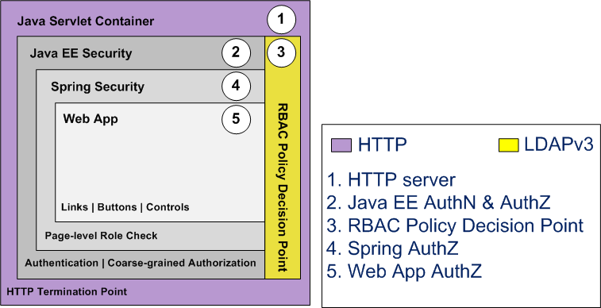

© 2025 iamfortress.net
# Overview of the role-engineering-sample README

 * This document demonstrates how to build and deploy the fortress role engineering sample.
 * The intent is to demonstrate standard RBAC role engineering practice.
 * The intent is not a how-to guide for fortress security in java web envs.  For that look to [apache-fortress-demo](https://github.com/shawnmckinney/apache-fortress-demo)
 * For more info about the role engineering process: [The Seven Steps of Role Engineering](https://iamfortress.net/2015/03/05/the-seven-steps-of-role-engineering/)
 * Screencast: [A Practical Guide To Role Engineering](https://www.youtube.com/watch?v=7rliMQEpPFI)
 * Role Engineering Sample App System Diagram
 

-------------------------------------------------------------------------------
## Prerequisites
1. Java >= 17
2. Apache Maven >= 3
3. Apache Tomcat >= 11
4. Basic LDAP server setup by completing one of these:
    * [OpenLDAP & Fortress QUICKSTART](https://github.com/apache/directory-fortress-core/blob/master/README-QUICKSTART-SLAPD.md)
    * [OpenLDAP & Fortress QUICKSTART on DOCKER](https://github.com/apache/directory-fortress-core/blob/master/README-QUICKSTART-DOCKER-SLAPD.md)
    * [APACHEDS & Fortress QUICKSTART](https://github.com/apache/directory-fortress-core/blob/master/README-QUICKSTART-APACHEDS.md)    
    * [APACHEDS & Fortress QUICKSTART on DOCKER](https://github.com/apache/directory-fortress-core/blob/master/README-QUICKSTART-DOCKER-APACHEDS.md)
    * [ansible-apache-fortress](https://gitlab.symas.net/symas-public/ansible-apache-fortress)
   
-------------------------------------------------------------------------------
## Prepare role-engineering-sample package

#### 1. Stage the project.

 a. Download and extract from Github:

```bash
wget https://github.com/shawnmckinney/role-engineering-sample/archive/master.zip
```

 -- Or --

 b. Or `git clone` locally:

```git
git clone https://github.com/shawnmckinney/role-engineering-sample.git
```

#### 2. Change directory into it:

```bash
cd role-engineering-sample
```

#### 3. Enable an LDAP server:

a. Copy the example:

```bash
cp src/main/resources/fortress.properties.example src/main/resources/fortress.properties
```

b. Edit the file:

```bash
vi src/main/resources/fortress.properties
```

Pick either Apache Directory or OpenLDAP server:

c. Prepare fortress for ApacheDS usage:

```properties
# This param tells fortress what type of ldap server in use:
ldap.server.type=apacheds

# Use value from [Set Hostname Entry]:
host=localhost

# ApacheDS defaults to this:
port=10389

# These credentials are used for read/write access to all nodes under suffix:
admin.user=uid=admin,ou=system
admin.pw=secret
```

-- Or --

d. Prepare fortress for OpenLDAP usage:

```properties
# This param tells fortress what type of ldap server in use:
ldap.server.type=openldap

# Use value from [Set Hostname Entry]:
host=localhost

# OpenLDAP defaults to this:
port=389

# These credentials are used for read/write access to all nodes under suffix:
admin.user=cn=Manager,dc=example,dc=com
admin.pw=secret
```

-------------------------------------------------------------------------------
## Prepare Tomcat for Java EE Security

This sample web app uses Java EE security.

#### 1. Download the fortress realm proxy jar into tomcat/lib folder:

```
wget https://repo.maven.apache.org/maven2/org/apache/directory/fortress/fortress-realm-proxy/[version]/fortress-realm-proxy-[version].jar -P $TOMCAT_HOME/lib
```

  where *TOMCAT_HOME* matches your target env.

#### 2. Prepare tomcat to allow autodeploy of role-engineering-sample web app:

```
sudo vi /usr/local/tomcat8/conf/tomcat-users.xml
```

#### 3. Add tomcat user to deploy role-engineering-sample:

```
 <role rolename="manager-script"/>
 <role rolename="manager-gui"/>
 <user username="tcmanager" password="m@nager123" roles="manager-script"/>
```

#### 4. Restart tomcat for new settings to take effect.

 Note: The proxy is a shim that uses a [URLClassLoader](http://docs.oracle.com/javase/7/docs/api/java/net/URLClassLoader.html) to reach its implementation libs.  It prevents
 the realm impl libs, pulled in as dependency to web app, from interfering with the container’s system classpath thus providing an error free deployment process without
 classloader issues.  The proxy offers the flexibility for each web app to determine its own version/type of security realm to use, satisfying a variety of requirements
 related to web hosting and multitenancy.

-------------------------------------------------------------------------------
## Build and deploy role-engineering-sample

#### 1. Set java and maven home env variables.

#### 2. Run this command from the root package:

  Deploy to tomcat server:

```maven
mvn clean tomcat:deploy -Dload.file
```

  Or if already deployed:

```maven
mvn clean tomcat:redeploy -Dload.file
```

   -Dload.file tells maven to automatically load the role-engineering-sample security policy into ldap.  Since the load needs to happen just once, you may drop the arg from future ops:

```maven
mvn tomcat:redeploy
```
 **Note**: if problem  with tomcat auto-deploy, manually deploy role-engineering-sample.war to webapps or change connection info used during tomcat:deploy in [pom.xml](pom.xml).

```
 <plugin>
     <groupId>org.codehaus.mojo</groupId>
     <artifactId>tomcat-maven-plugin</artifactId>
     <version>1.0-beta-1</version>
     <configuration>
     ...
         <url>http://localhost:8080/manager/text</url>
         <path>/${project.artifactId}</path>
         <!-- Warning the tomcat manager creds here are for deploying into a demo environment only. -->
         <username>tcmanager</username>
         <password>m@nager123</password>
     </configuration>
 </plugin>
```

-------------------------------------------------------------------------------
## Understand the security policy using RBAC

Security policy was derived from this:


To gain full understanding, check out the file used to load it into the LDAP directory: .

App comprised of three pages, each has buttons and links that are guarded by permissions.  The permissions are granted to a particular user via their role assignments.  But those
privileges are only realized after role activation.

For this app, user-to-role assignments are:
### User-to-Role Assignment Table

| user          | Role_Buyers   | Role_Sellers  |
| ------------- | ------------- | ------------- |
| johndoe       | true          | true          |
| ssmith        | true          | false         |
| rtaylor       | false         | true          |

Both roles inherit from a single parent:
### Role Inheritance Table

| role name     | parent name   |
| ------------- | ------------- |
| Role_Buyers   | Users         |
| Role_Sellers  | Users         |

The page-lxevel authorization uses Spring Security's **FilterSecurityInterceptor** which maps the roles activated using what was received from the servlet container (via the Tomcat Realm).

User to Page access is granted as:
### User-to-Page Access Table

| user          | Home Page     | Buyers Page  | Sellers Page |
| ------------- | ------------- | ------------- | ------------- |
| johndoe       | true          | true          | true          |
| ssmith        | true          | true          | false         |
| rtaylor       | true          | false         | true          |

But a mutual exclusion constraint between the **role_buyers** and **role_sellers** restricts activation during runtime:
### Role-to-Role Dynamic Separation of Duty Constraint Table

| set name      | Set Members   | Cardinality   |
| ------------- | ------------- | ------------- |
| BuySel        | Role_Sellers  | 2             |
|               | Role_Buyers   |               |
|               |               |               |

Preventing any one user from being both at same time.

The buttons are guarded by rbac permission checks.  The permissions are dependent on which roles are active.

Below is the list of permissions by user.  These list can be returned using [sessionPermissions](https://directory.apache.org/fortress/gen-docs/latest/apidocs/org/apache/directory/fortress/core/AccessMgr.html#sessionPermissions(org.apache.directory.fortress.core.rbac.Session)) API.  When testing, keep in mind that DSD constraints further limit preventing access to all at the same time.

### User-to-Permission Access Table

| user          | account.create | item.search    | item.bid       | item.buy       | item.ship      | auction.create | BuyersPage.link  | SellersPage.link |
| ------------- | -------------- | -------------- | -------------- | -------------- | -------------- | -------------- | ---------------- | ---------------- |
| johndoe       | true           | true           | true           | true           | true           | true           | true             | true             |
| ssmith        | true           | true           | true           | true           | false          | false          | true             | false            |
| rtaylor       | true           | false          | false          | true           | true           | true           | false            | true             |

**DSD constraint between the Role_Buyers and Role_Sellers prevents johndoe from activating both simultaneously.**

In a standard RBAC setting the web app could provide a drop-down control where the user gets to choose active role.
This would allow user to choose between performing as a Buyer or Seller on a given session.

To see how this can be done, check out: [apache-fortress-demo](https://github.com/shawnmckinney/apache-fortress-demo)

-------------------------------------------------------------------------------
## Manually Test the role engineering sample

#### 1. Open link to [http://localhost:8080/role-engineering-sample](http://localhost:8080/role-engineering-sample)

#### 2. Login with Java EE authentication form:
 

#### 3. User-Password Table

 | userId        | Password      |
 | ------------- | ------------- |
 | johndoe       | password      |
 | ssmith        | password      |
 | rtaylor       | password      |

#### 4. If everything is working, the Home page loads with some links and buttons to click on:
 

#### 5. Try a different user.
  * Each has different access rights to application.
  * A DSD constraint prevents user **johndoe** from activating both buyer and seller role at same time.
  * All users have **account.create** and **item.search** through role inheritance with the base role: **Users**.

#### 6. Switch Roles
  * Roles that are assigned to **Super_Users**, **Role_Buyers** and **Role_Sellers** may switch between Buyer and Seller functions.
  * Test with user **johndoe** who has the necessary role assignments.
  * Johndoe cannot activated both roles in session at same time but can activate either role - using the switch button.
  * Switch from Buyer to Seller 
  * Switch from Seller to Buyer 
  * Without **Super_Users** role assigned will receive this error: 

#### 7. Test with different assignments.
  * Use [fortress-web](https://directory.apache.org/fortress/gen-docs/latest/apidocs/org/apache/directory/fortress/core/doc-files/apache-fortress-web.html) or the
  [fortress-core command-line-interface](https://directory.apache.org/fortress/gen-docs/latest/apidocs/org/apache/directory/fortress/core/cli/package-summary.html)
  to setup new users with new role combinations.  How does the app respond with different policies?  What needs to change to make it better?

## Automatically Test the role engineering sample

Run the selenium automated test:

 ```
 mvn test -Dtest=RoleSampleSeleniumITCase
 ```

 Selenium Test Notes:
 * *This test will log in as each user, perform positive and negative test cases.*
 * *Requires Firefox on target machine.*

## Enable Java Security Manager (Optional)

#### 1. Add to java policy file:

  ```
grant codeBase "file:${catalina.home}/webapps/role-engineering-sample/-" {
    permission java.util.PropertyPermission "org.apache.commons.configuration.filesystem", "read";
    permission java.util.PropertyPermission "org.apache.directory.fortress", "read";
    permission java.util.PropertyPermission "fortress.*", "read";
    permission java.util.PropertyPermission "getenv.*", "read";
    permission java.util.PropertyPermission "net.sf.ehcache.*", "read";
    permission java.util.PropertyPermission "wicket.*", "read";
    permission java.util.PropertyPermission "Wicket_HeaderRenderStrategy", "read";
    permission java.util.PropertyPermission "java.io.tmpdir", "read";
    permission java.util.PropertyPermission "tc.active", "read";
    permission java.util.PropertyPermission "org.springframework.security.core.*", "read";
    permission java.util.PropertyPermission "spring.security.strategy", "read";
    permission java.lang.RuntimePermission "getenv.*", "*";
    permission java.lang.RuntimePermission "accessClassInPackage.org.apache.catalina.util";
    permission java.lang.RuntimePermission "accessDeclaredMembers";
    permission java.lang.RuntimePermission "modifyThread";
    permission java.net.SocketPermission "localhost", "resolve";
    permission java.net.SocketPermission "127.0.0.1:32768", "connect,resolve";
    // This one is req'd by xerces:
    permission  java.lang.reflect.ReflectPermission "suppressAccessChecks";
    permission java.io.SerializablePermission "enableSubclassImplementation";
    };

  ```

#### 2. Modify Tomcat server.xml:

  ```
   <Host name="localhost"  appBase="webapps"
    unpackWARs="true" autoDeploy="true"
    deployXML="true">                            <--- Add this declaration
 ```
